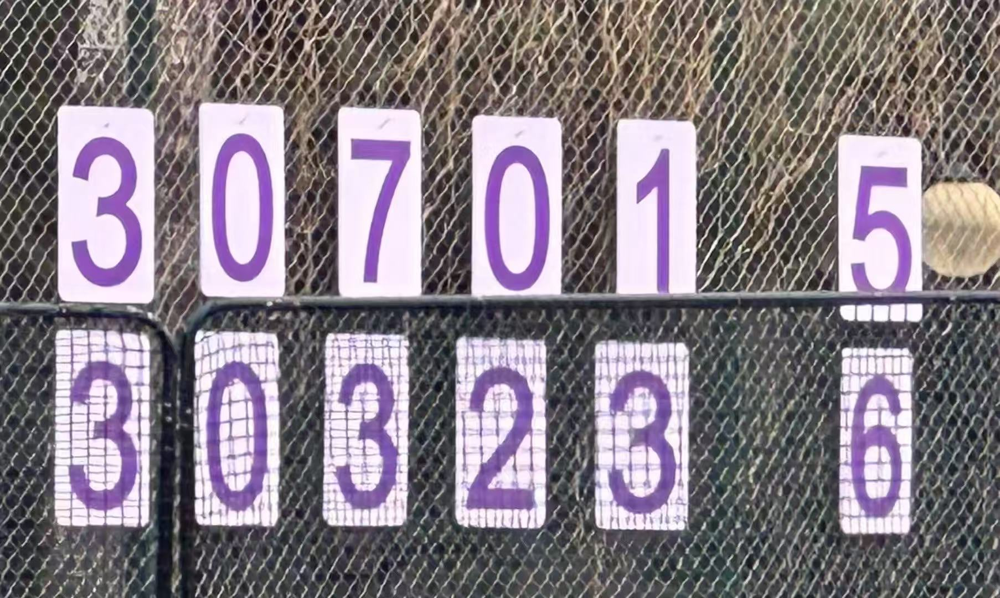

The final game of the Shuimu Cup on May 25th, 2025 was, without a doubt, the most exhilarating match of my college years.

Three home runs from the opponents carved out a seemingly unbridgeable chasm. The game was dragged into extra innings, taut with tension. Then—came the comeback, the lead, and the victory.

The full-throttle moments frozen by Donnie’s lens, the deafening roar from the stands, the stacked hands cheering as one, and finally, the whole team bursting onto the field in a sweeping embrace.

All those colors, all that passion—enough to outshine even the most intense scenes from a shōnen manga.

As if in response to the wish I had made at the beginning of the Shuimu Cup, fate granted me a finale as exhilarating as I had dared to dream.

Though I’m usually the one in the outfield immersed in “spectator mode,” this time, even on defense, I felt utterly, vividly present.

The rundown play passed through five swift and steady hands before the final tag landed in mine. With the foresight of a god, our coach Richard called for a shift—so precise that the final out landed straight into my glove.

Twice I got on base with clean hits to second, and both times my teammates brought me home.

When we were down to our very last out from a total defeat, it was my turn at bat. "Don’t be nervous!" Shark yelled from first base—yet his nervous couldn’t hide its own nerves.

But come on—that’s me.

My dictionary doesn’t include pressure in the face of failure. My favorite storyline is the one where the tide is turned. And if my effort alone isn’t enough to turn it, then my teammates will rise and keep turning it.

Even in the bleakest moments of the game, I carried a ridiculous, contradictory kind of optimism:
Half calm—“Even if we lose, this was already epic.”
Half cocky—“How could a game with me in it possibly end in defeat?”

And when the comeback became reality, all those stumbles and near-defeats turned into narrative thorns in a classic tale, making the final crown all the more precious and sweet.

When the people around me tacitly stepped aside to form a circle and called out my name and Yutong’s in unison, I was still sitting dumbfounded on the grass, a single thought spinning in my head:
“Huh? Am I really today’s lucky lead?”

It wasn’t until someone handed me a bouquet of flowers that it truly hit me—
This was my final game in the Tsinghua Garden.

Trophy, flowers, a custom cake with my name iced on top, a lovingly handmade scrapbook, a thick stack of photos and blessings, the laughter captured by Donnie’s lens, and our tangled, tired bodies sprawled out on the grass together.

Just as I never dared to hope for such a spectacular match to close this journey, I never imagined I’d be the one standing at its center, wrapped in such a romantic farewell. 

So complete.

Unwittingly, four years had passed with this team. I had become someone the coach could be proud of, someone teammates could rely on, someone juniors might admire—and now, I would quietly become a part of Tsinghua softball’s memory.

What a beautiful way for it all to end.

